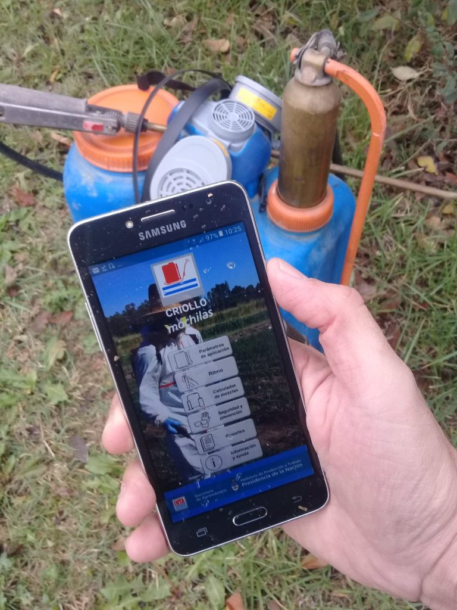

# Criollo Mochilas 2.0

Criollo mochilas es una App para dispositivos móviles que brinda las herramientas necesarias para realizar la calibración de mochilas pulverizadoras. Permite calcular volumen pulverizado en l/ha y las cantidades de productos necesarias en función de las dosis prescriptas. La información que genera puede almacenarse en reportes que pueden ser compartidos por WhatsApp, mail o redes sociales.

### [Disponible en Google Play!](https://play.google.com/store/apps/details?id=com.inta.criollom)  



### Versión 2.0 [2] (Migración nativo -> híbrido)
  - Implementación con Vite (Rollup): ReactJS (v18) + Framework7 + Capacitor.
  - Nueva presentación. Mejoras en control y validación de campos.  
  - El almacenamiento de los datos se realiza en Storage de Capacitor en el caso nativo, en avt.storage en el caso de la extensión Auravant o en localStorage en el caso web.  


## Instalación y despliegue

Descargar código fuente e instalar dependencias
```bash
$ git clone https://github.com/sendevo/criollo-mochilas  
$ cd criollo-mochilas  
$ npm install  
```

Correr versión web para debug (localhost:3000)
```bash
$ npm run dev
```

Compilar versión web optimizada
```bash
$ npm run build
```

### Compilar apk (android) por primera vez:
1.- Instalar android studio y ubicar carpeta de instalación.  

2.- Agregar plataforma con capacitor y generar proyecto android-studio:  

```bash
$ export CAPACITOR_ANDROID_STUDIO_PATH="..../android-studio/bin/studio.sh"
$ export PATH=~/.npm-global/bin:$PATH  
$ npx cap add android
$ npm run build && npx cap sync
```

3.- Agregar permisos en android/app/src/main/AndroidManifest.xml:  

```xml
...
<aplication>
  ...
  android:requestLegacyExternalStorage="true"
  ...
</application>
...
<uses-permission android:name="android.permission.INTERNET" />
<uses-permission android:name="android.permission.READ_EXTERNAL_STORAGE"/>
<uses-permission android:name="android.permission.WRITE_EXTERNAL_STORAGE" />
```

4.- Definir iconos y splashcreens en android/app/src/main/res.  

5.- Abrir proyecto de AndroidStudio:
```bash
$ npx cap open android
```

### Recompilar apk (android) luego de cambios en la versión web:
```bash
$ npm run build && npx cap sync
$ npx cap open android
```

### Compilar versión release con AndroidStudio:  
1.- Editar versionName y versionCode en android/app/build.gradle   
2.- Ir al menú Build -> Generate Signed Bundle/APK...  
3.- Ingresar directorio de la firma (.jks), claves "Key Store Password" y "Key Password".  
4.- Generar app-release.apk o app-release.aab.   
5.- Preparar capturas de pantalla y lista de cambios.   


### Backlog

  - [ ] Iconos de ritmo: lento, medio y rapido.  
  - [ ] Audio de paso.  
